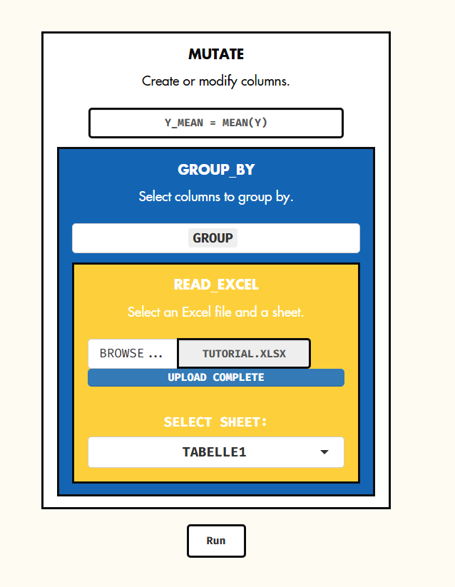

# InferBlock: A Visual Meta-Programming Framework for Divisible and Transparent Data Analysis Pipelines

## Untangling Data: A Scientist's Guide to InferBlock vs. Manual Excel Methods

For scientists accustomed to wrangling data in spreadsheets, the prospect of learning a new programming language like R can be daunting. However, for many data manipulation tasks, **InferBlock** offers a user-friendly, more efficient and reproducible workflow compared to manual approaches in Excel. 
This guide provides direct comparisons of common tasks – e.g. calculating group means – to illustrate the power and simplicity of InferBlock.

### Group Averages
#### The Scenario: Calculating Group Averages

Imagine you have experimental data in a simple table with three columns: 'x' (e.g., sample ID), 'y' (e.g., a measured value), and 'group' (e.g., the treatment group). Your goal is to calculate the average of the 'y' values for each group and add this information as a new column, 'y_mean', to your original dataset.

**Sample Dataset:**

| x | y | group |
|---|---|---|
| 1 | 10 | A |
| 2 | 12 | A |
| 3 | 14 | A |
| 4 | 20 | B |
| 5 | 22 | B |
| 6 | 24 | B |
| 7 | 15 | C |
| 8 | 17 | C |
| 9 | 19 | C |

#### The "Naive" Excel Approach

For an Excel user unfamiliar with advanced functions like Pivot Tables, this task becomes a multi-step, manual process prone to errors:

1.  **Sort by Group:** First, you would sort the entire table by the 'group' column to bring all the 'A's, 'B's, and 'C's together.
2.  **Calculate Group Means Separately:** You would then select the 'y' values for the first group (A), and in an empty cell, use the `AVERAGE` function to calculate their mean. You would repeat this for group B and group C, placing their respective means in other empty cells.
3.  **Create the New Column:** You would add a new column header, "y_mean".
4.  **Manual Copy and Paste:** Finally, you would manually copy the calculated mean for group A and paste it into the 'y_mean' column for all the rows belonging to group A. You would then repeat this tedious process for groups B and C.

This method, while functional for a small dataset, quickly becomes cumbersome and error-prone with larger and more complex datasets. Any changes to the original data would require repeating the entire process.

#### The InferBlock Approach: Using a Grammar for Data Manipulation

InferBlock provides a set of intuitive "blocks" for data manipulation. To achieve the same result as the manual Excel method, you would nest concise and readable visual blocks, where data flows from the innermost block outwards, with each containing block applying its function to the result of the one inside it. 

Here are the nested visual blocks:

Let's break down these nested blocks:

*   `READ_EXCEL`: This starts the chain of operations on our `data`.
*   `GROUP_BY`: This is the core function. It tells to perform the next operation separately for each unique value in the 'group' column. It doesn't change the appearance of the data, but it changes how subsequent functions work.
*   `MUTATE`: The `MUTATE`block is used to create a new column. Here, we're creating a column named `y_mean`. The value of this new column is the `mean()` of the 'y' column for each group defined by `GROUP_BY`.

The result, will be:

| x | y | group | y_mean |
|---|---|---|---|
| 1 | 10 | A | 12 |
| 2 | 12 | A | 12 |
| 3 | 14 | A | 12 |
| 4 | 20 | B | 22 |
| 5 | 22 | B | 22 |
| 6 | 24 | B | 22 |
| 7 | 15 | C | 17 |
| 8 | 17 | C | 17 |
| 9 | 19 | C | 17 |

#### Side-by-Side Comparison

| Feature | Naive Excel Approach | InferBlock Approach |
| :--- | :--- | :--- |
| **Steps** | Multiple manual steps (sort, calculate, copy, paste) | A single, visual nested block |
| **Reproducibility** | Difficult to reproduce accurately; prone to human error | Fully reproducible; the visual is a clear record of the steps |
| **Scalability** | Becomes extremely time-consuming and error-prone with large datasets | Handles large datasets efficiently |
| **Readability** | The process is not self-documenting | The visual is clear and easy to understand, following a "grammar" of data manipulation |
| **Updating** | Requires repeating the entire process if data changes | Simply re-run InferBlock to update the results with new data |

---

### Normalization to control
#### The Scenario: Normalizing Data to a Control Group

In many biological experiments, it's standard practice to compare the results of treatment groups to a control group. Normalization expresses each data point as a fold change relative to the control's average, making it easier to compare the effects of different treatments.

Let's use a slightly modified dataset. Our goal is to calculate the mean of the 'y' values for the control group (`ctl`) and then divide each individual 'y' value by this control mean to get a new 'y_normalized' column.

**Sample Dataset:**

| x | y | group |
|---|---|---|
| 1 | 10 | ctl |
| 2 | 12 | ctl |
| 3 | 11 | ctl |
| 4 | 22 | treat1 |
| 5 | 24 | treat1 |
| 6 | 23 | treat1 |
| 7 | 5 | treat2 |
| 8 | 6 | treat2 |
| 9 | 4 | treat2 |

#### The "Naive" Excel Approach

For a user not employing advanced functions, normalizing data in Excel is a manual and fragmented process:

1.  **Isolate the Control Group:** The user would first identify all the rows belonging to the `ctl` group.
2.  **Calculate the Control Mean:** In a separate, empty cell (say, `F1`), they would use the `AVERAGE` function to calculate the mean of the 'y' values for *only* the `ctl` rows. For our sample data, this would be `AVERAGE(B2:B4)`, which is 11.
3.  **Create the New Column:** They would add a new column header, "y_normalized".
4.  **Write the Division Formula:** In the first cell of the new column (e.g., `D2`), they would write a formula to divide the corresponding 'y' value by the control mean calculated in step 2. **Crucially**, they must use an absolute reference (`$F$1`) for the control mean so it doesn't change when the formula is dragged down. The formula in cell `D2` would be `=B2/$F$1`.
5.  **Fill Down the Formula:** The user would then click on the small square at the bottom-right of cell `D2` and drag it down to apply this normalization formula to all rows in the dataset.

This process has several pitfalls. If the location of the calculated control mean changes, all formulas break. Furthermore, ensuring the correct use of absolute (`$F$1`) versus relative (`B2`) references is a common source of errors for inexperienced users.

#### The InferBlock Approach

**InferBlock** handles this task elegantly within a single chain of blocks. The logic is clear: first, calculate the control mean, and then use that single value to transform the entire dataset.

Here are the nested visual blocks:

Let's trace the data through this pipe step-by-step:

*   `READ_EXCEL`: This starts the chain of operations on our `data`.
* `MUTATE`: This is the first transformation.
    *   It calculates the control mean `mean(y[group == "ctl"])`, which is 11.
    *   It then creates a new column called `ctl_mean` and fills **every row** of that column with the value 11.
* `MUTATE`: This is the second transformation.
    *   It takes the data frame from the previous step (which now includes the `ctl_mean` column).
    *   It creates a final column, `y_normalized`, by dividing the value in the `y` column by the value in the `ctl_mean` column for each row.

The final output, contains the intermediate column, making the calculation completely transparent.

| x | y | group | ctl_mean | y_normalized |
|---|---|---|---|---|
| 1 | 10 | ctl | 11 | 0.909 |
| 2 | 12 | ctl | 11 | 1.091 |
| 3 | 11 | ctl | 11 | 1.000 |
| 4 | 22 | treat1 | 11 | 2.000 |
| 5 | 24 | treat1 | 11 | 2.182 |
| 6 | 23 | treat1 | 11 | 2.091 |
| 7 | 5 | treat2 | 11 | 0.455 |
| 8 | 6 | treat2 | 11 | 0.545 |
| 9 | 4 | treat2 | 11 | 0.364 |

#### Side-by-Side Comparison

| Feature | Naive Excel Approach | InferBlock Approach |
| :--- | :--- | :--- |
| **Readability** | Poor. The logic is fragmented between a value in one cell and a formula in another. | Excellent. The nested blocks read like a narrative: "First, create a column with the control mean, then create a normalized column by dividing by it." |
| **Debugging** | Difficult. If a result is wrong, you have to manually check the formula and the referenced cell for errors. | Easy. You can run the blocks to the first `MUTATE` to check if the `ctl_mean` column was calculated correctly before proceeding. |
| **Clarity of Intent** | The purpose of the random cell with the average (`F1`) is not inherently clear. | The column name `ctl_mean` is explicit and self-documenting. The intent is unmistakable. |
| **Encapsulation** | The logic is spread out across the worksheet. | The entire logical flow is contained within a single visual nested block. |
| **Reproducibility** | Relies on manual steps that are hard to document and repeat reliably. | The visual is a perfect, repeatable recipe for the entire transformation. |

This step-by-step method within a single visual nested block is often the best of all worlds for collaborative work. It is powerful and reproducible and its explicit, sequential logic from the innermost block outwards makes it exceptionally easy for colleagues to read, understand, and trust the process.

---

### Bechmark Response (BMR) Level 
#### The Scenario: Estimating BMR level for ToxCast data

At a high level, this section is designed to process a large dataset from ToxCast database. Its specific goal is to:

1.  Isolate the data for **one single assay** named "CCTE_Mundy_HCI_Cortical_NOG_NeuriteLength".
2.  Clean the data by removing low-quality measurements.
3.  Perform a **first normalization** to convert raw activity values into a percentage relative to the on-plate negative controls.
4.  Perform a **second normalization** to set the activity at the lowest tested concentration of each chemical as the 100% baseline.

This entire process transforms raw instrument readings into a clean, normalized dataset ready for concentration-response analysis for that specific neurite length assay.

### Step-by-Step Block Explanation

Here is a line-by-line breakdown of what each block does and why it's important.

#### **Step 1: Reading the Data**

*   **What it Does:** This command reads the Excel file named `"ToxCastTutorial.xlsx"`, specifically from the sheet named `"Tabelle1"`, and loads all of its contents ready to pass this entire table to the next block.
*   **Why it's Done:** This is the starting point. It gets the raw data from the Excel file into the InferBlock environment so the analysis can begin.

---

#### **Step 2: Filtering for a Specific Assay**

*   **What it Does:** This is a critical filtering step. It goes through the entire table and keeps **only the rows** where the value in the **`acnm`** (assay component name) column exactly matches `"CCTE_Mundy_HCI_Cortical_NOG_NeuriteLength"`. All other rows are discarded.
*   **Why it's Done:** A raw data file from ToxCast often contains results from dozens or hundreds of different biological assays. This command immediately focuses the entire analysis on the single experiment you care about—in this case, an assay measuring the effect of chemicals on neurite length.

---

#### **Step 3: Filtering for High-Quality Wells**

*   **What it Does:** From the remaining data (which is now only from the one neurite length assay), this command keeps *only the rows where the **`wllq`** (well quality) column has a value of `1`.
*   **Why it's Done:** High-throughput screening systems perform automated quality control on each well of a plate. A `wllq` of `1` typically signifies a valid, high-quality measurement. Any wells flagged with errors (e.g., `wllq = 0`) are removed to ensure the analysis is based on reliable data.

---

#### **Step 4: Grouping by Plate**

*   **What it Does:** This block doesn't change the data's appearance but adds "invisible labels" that group the rows based on their shared value in the **`apid`** (assay plate ID) column. All calculations in the following steps will be performed separately within each of these plate groups.
*   **Why it's Done:** Experimental conditions can vary slightly between different physical plates. Grouping by `apid` ensures that when you normalize data, each well is only compared to control wells from the *exact same plate*, which is essential for accurate scientific results.

---

#### **Step 5: Calculating the Control Mean for Each Plate**

*   **What it Does:** This creates a new column named **`ctl_mean`**. For each plate group, it calculates the average (`mean`) of the values in the **`rval`** (raw value) column, but only from rows where the **`wllt`** (well type) is `"n"` (likely for "negative control"). This single calculated value is then added to every row belonging to that plate.
*   **Why it's Done:** This establishes the baseline or "zero effect" level for each plate by averaging the signal from its negative control wells. This value is the foundation for the first normalization.

---

#### **Step 6: Normalizing Raw Values to Controls**

*   **What it Does:** This creates another new column, **`rval_normalized`**. For each row, it calculates a new value by taking its **`rval`**, dividing it by the plate-specific **`ctl_mean`**, and multiplying by 100.
*   **Why it's Done:** This converts the raw, arbitrary fluorescence or imaging units into an intuitive "percent of control activity". A value of `90` means the neurite length in that well was 90% of the average control length. This makes results comparable across different plates.

---

#### **Step 7: Removing Rows with No Chemical Name**

*   **What it Does:** This filters the data again, keeping only the rows where the **`chnm`** (chemical name) column is *not* empty (`!is.na` means "is not NA").
*   **Why it's Done:** At this point, the control wells have served their purpose for the first normalization. This step removes them (as they don't have a chemical name) and any other data points missing a chemical identifier, leaving only the data for wells treated with a specific chemical.

---

#### **Step 8: Re-Grouping by Chemical and Plate**

*   **What it Does:** This command updates the grouping. All subsequent steps will now be performed on data grouped by each unique combination of **`chnm`** (chemical name) and **`apid`** (assay plate ID).
*   **Why it's Done:** The focus of the analysis now shifts to the behavior of each individual chemical on a specific plate.

---

#### **Step 9 & 10: Finding and Keeping Only the Lowest Concentration Data**

*   **What it Does:** This is a two-step maneuver to isolate a specific set of data.
    1.  `MUTATE`: First, for each chemical-plate group, it finds the lowest (`min`) value in the **`conc`** (concentration) column and puts that value in a new temporary column called `min_conc`.
    2.  `FILTER`: Second, it throws away all rows *except* those where the concentration (`conc`) is the same as the minimum concentration (`min_conc`).
*   **Why it's Done:** This is a clever way to isolate the data points for the starting concentration of each chemical's dose-response curve. This "baseline activity" for the chemical itself will be used for the second round of normalization.

---

#### **Step 11, 12, & 13: The Second Normalization**

*   **What it Does:** This is the final calculation.
    1.  `GROUP_BY`: This re-establishes the grouping (this is often done for clarity, even if the grouping is already active).
    2.  `MUTATE`: It calculates the average of the `rval_normalized` values (which are all from the lowest concentration) and puts this average in a new column, **`rval_normalized_mean`**.
    3.  `MUTATE`: Finally, it creates the ultimate output column, **`rval_fin`**. It takes the normalized value and divides it by the average normalized value at that lowest concentration, multiplying by 100.
*   **Why it's Done:** This second normalization sets the activity measured at the *lowest concentration of the chemical* to be the new 100% baseline.

From the resulting data distribution induced by the normalized activities at the lowest concentration of chemicals we deduce the BMR.

This entire chain of blocks is a powerful, clear, and reproducible recipe for a complex data transformation that would be a nightmare to perform manually in Excel.
